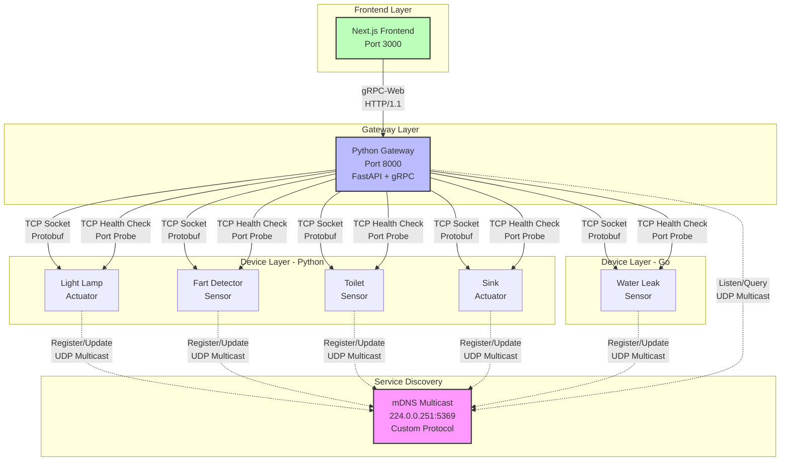
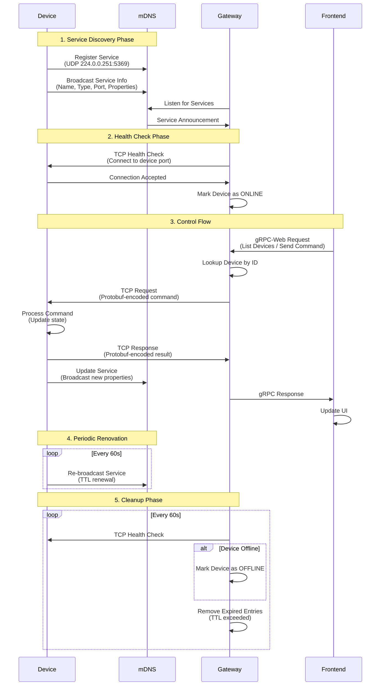
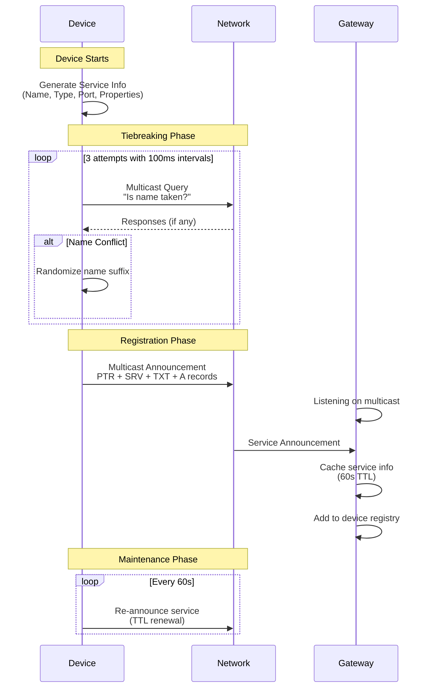
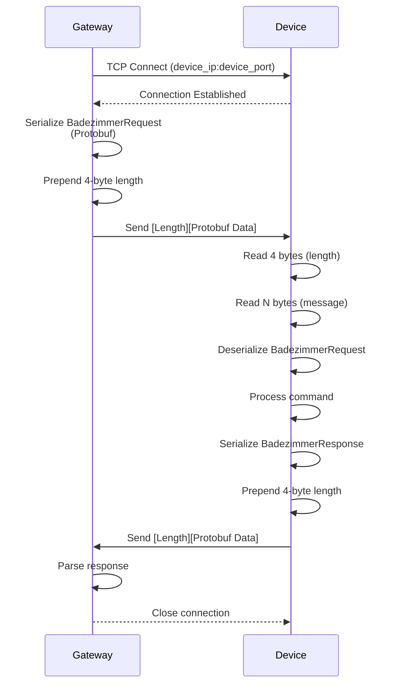

# Badezimmer 🚽

A distributed IoT system for bathroom device management using custom mDNS-based service discovery, gRPC communication, and real-time device monitoring. Built as a microservices architecture demonstrating device registration, health monitoring, and control through a modern web interface.

## 📋 Table of Contents

- [Architecture Overview](#architecture-overview)
- [Technology Stack](#technology-stack)
- [Project Structure](#project-structure)
- [Communication Protocols](#communication-protocols)
- [Device Types](#device-types)
- [Getting Started](#getting-started)
- [Development](#development)
- [API Documentation](#api-documentation)

## 🏗️ Architecture Overview

Badezimmer implements a microservices-based IoT platform where devices self-register through a custom mDNS protocol, communicate via TCP sockets for health checks, and expose gRPC-over-HTTP APIs for frontend control.



### Communication Flow



## 🛠️ Technology Stack

### Backend Services
- **Python 3.12+**: Core device services and gateway
  - `fastapi`: REST and gRPC-Web gateway server
  - `grpcio`: Protocol Buffers and gRPC implementation
  - `zeroconf`: mDNS service discovery foundation
  - `asyncudp`: Async UDP socket handling for multicast
  - `asyncio`: Async I/O for concurrent operations
  - `uv`: Fast Python package manager and project manager

- **Go 1.21+**: High-performance water leak sensor
  - Custom mDNS implementation
  - Native protobuf support

### Frontend
- **Next.js 14+**: React-based UI framework
- **TypeScript**: Type-safe frontend development
- **gRPC-Web**: Browser-compatible gRPC client
- **Radix UI**: Accessible component primitives
- **Tailwind CSS**: Utility-first styling

### Infrastructure
- **Protocol Buffers**: Schema-defined serialization (proto3)
- **Docker & Docker Compose**: Containerization and orchestration
- **Chainguard Images**: Minimal, secure container base images

## 📁 Project Structure

```
badezimmer/
├── proto/                          # Protocol Buffers definitions
│   └── badezimmer.proto           # Service, message, and enum schemas
│
├── src/                            # Python source code
│   ├── badezimmer/                # Shared library package
│   │   ├── mdns.py               # Custom mDNS protocol implementation
│   │   ├── tcp.py                # TCP socket utilities and protobuf helpers
│   │   ├── browser.py            # Service browser for discovery
│   │   ├── info.py               # Service info and cache management
│   │   ├── logger.py             # Structured logging setup
│   │   ├── badezimmer_pb2.py     # Generated protobuf messages
│   │   └── badezimmer_pb2_grpc.py # Generated gRPC service stubs
│   │
│   ├── gateway/                   # Central gateway service
│   │   └── __init__.py           # FastAPI app, gRPC server, device management
│   │
│   ├── lightlamp/                 # Light actuator device
│   │   └── __init__.py           # Lamp control logic, TCP server
│   │
│   ├── fartdetector/              # Fart detection sensor
│   │   └── __init__.py           # Sensor logic and periodic updates
│   │
│   ├── toilet/                    # Toilet sensor device
│   │   └── __init__.py           # Flush detection and monitoring
│   │
│   └── sink/                      # Sink actuator device
│       └── __init__.py           # Water flow control
│
├── go-water-leak/                 # Go-based water leak sensor
│   ├── main.go                   # Main sensor application
│   ├── mdns.go                   # mDNS implementation in Go
│   ├── badezimmer/               # Generated Go protobuf code
│   │   └── badezimmer.pb.go
│   └── go.mod                    # Go module dependencies
│
├── badezimmer-home-page/          # Next.js frontend application
│   ├── app/                      # Next.js app router
│   │   ├── page.tsx             # Home page with device grid
│   │   └── layout.tsx           # Root layout
│   │
│   ├── components/               # React components
│   │   ├── device-card.tsx      # Individual device display
│   │   ├── device-controls.tsx  # Control panel for devices
│   │   ├── device-grid.tsx      # Device list grid
│   │   └── ui/                  # Radix UI component library
│   │
│   ├── lib/                      # Utility libraries
│   │   ├── grpc-client.ts       # gRPC-Web client setup
│   │   ├── device-types.ts      # TypeScript type definitions
│   │   └── utils.ts             # Helper functions
│   │
│   ├── generated/                # Generated gRPC-Web stubs
│   │   ├── badezimmer_grpc_web_pb.js
│   │   └── badezimmer_pb.js
│   │
│   └── package.json              # Frontend dependencies
│
├── docker-compose.yaml            # Multi-service orchestration
├── Dockerfile                     # Python services image
├── Dockerfile.front               # Frontend image
├── Dockerfile.water-leak          # Go water leak sensor image
├── pyproject.toml                # Python project configuration
└── README.md                      # This file
```

## 🔌 Communication Protocols

### 1. Custom mDNS Protocol (Service Discovery)

The system implements a **custom multicast DNS protocol** for zero-configuration device discovery on the local network.

#### Protocol Details
- **Multicast Group**: `224.0.0.251:5369`
- **Transport**: UDP multicast
- **Encoding**: Protocol Buffers (defined in `badezimmer.proto`)

#### mDNS Message Structure

```protobuf
message MDNS {
  fixed32 transaction_id = 1;
  google.protobuf.Timestamp timestamp = 2;
  oneof data {
    MDNSQueryRequest query_request = 3;
    MDNSQueryResponse query_response = 4;
  }
}
```

#### Service Registration Flow



#### Record Types

The mDNS implementation uses four DNS record types:

1. **PTR (Pointer) Record**: Maps service type to instance name
   ```
   _lightlamp._tcp.local. → "Light Lamp._lightlamp._tcp.local."
   ```

2. **SRV (Service) Record**: Provides port and target host
   ```
   Service: _lightlamp._tcp.local.
   Port: 8080
   Target: light-lamp-host.local.
   ```

3. **TXT (Text) Record**: Key-value properties
   ```
   is_on=true
   brightness=75
   color=0xFF5733
   ```

4. **A (Address) Record**: IPv4 addresses
   ```
   light-lamp-host.local. → 192.168.1.100
   ```

#### Key Features

- **Tiebreaking**: Devices probe the network 3 times before registering to avoid name conflicts
- **Cache Flush**: Records include cache-flush flag for immediate updates
- **TTL Management**: 60-second default TTL with automatic renewal
- **Health Monitoring**: Gateway performs TCP health checks every 60 seconds
- **Goodbye Packets**: Devices send TTL=0 announcements when shutting down

### 2. TCP Socket Communication (Device Control)

All device-to-gateway communication uses **TCP sockets with length-prefixed Protobuf messages**.

#### Message Framing

```
┌─────────────────┬──────────────────────────┐
│  Length (4 bytes)  │   Protobuf Message      │
│   Big-Endian       │   (variable length)     │
└─────────────────┴──────────────────────────┘
```

#### Implementation (`tcp.py`)

```python
def prepare_protobuf_request(message: message.Message) -> bytes:
    """Prepares a Protobuf message for TCP transmission"""
    serialized_message = message.SerializeToString()
    message_length = len(serialized_message)
    length_prefix = message_length.to_bytes(4, byteorder="big")
    return length_prefix + serialized_message

def get_protobuf_data(data: bytes) -> bytes:
    """Extracts Protobuf message from TCP data"""
    message_length = int.from_bytes(data[:4], byteorder="big")
    return data[4:4 + message_length]
```

#### Request/Response Flow



### 3. TCP Health Checks

The gateway performs periodic TCP health checks to determine device availability:

```python
async def health_check(ip: str, port: int, timeout: float = 1.0) -> bool:
    """Attempts TCP connection to verify device is reachable"""
    try:
        reader, writer = await asyncio.wait_for(
            asyncio.open_connection(ip, port),
            timeout=timeout
        )
        writer.close()
        await writer.wait_closed()
        return True
    except Exception:
        return False
```

- **Frequency**: Every 60 seconds (configurable)
- **Timeout**: 1 second default
- **Action**: Devices failing health checks are marked as `OFFLINE`

### 4. gRPC-Web over HTTP (Frontend Communication)

The frontend communicates with the gateway using **gRPC-Web**, which encapsulates gRPC in HTTP/1.1.

#### Service Definition

```protobuf
service BadezimmerService {
  rpc ListConnectedDevices(ListConnectedDevicesRequest) 
      returns (ListConnectedDevicesResponse) {}
  
  rpc SendActuatorCommand(SendActuatorCommandRequest) 
      returns (SendActuatorCommandResponse) {}
}
```

#### Frontend Client (`grpc-client.ts`)

```typescript
const badezimmerClient = new BadezimmerServicePromiseClient(
  "http://localhost:8000",  // Gateway URL
  null,
  null
);

// List all devices
const devices = await badezimmerClient.listConnectedDevices(request, {});

// Send command to actuator
const response = await badezimmerClient.sendActuatorCommand(request, {});
```

#### Gateway gRPC Server (FastAPI)

The gateway implements a gRPC-Web bridge using FastAPI:

```python
@app.post("/badezimmer.BadezimmerService/ListConnectedDevices")
async def list_connected_devices(request: Request):
    # Parse gRPC-Web request
    # Query device registry
    # Return gRPC-Web response
```

#### Transport Details

- **Protocol**: HTTP/1.1 POST requests
- **Content-Type**: `application/grpc-web+proto`
- **Encoding**: Binary Protobuf
- **CORS**: Enabled for cross-origin frontend access

## 🎛️ Device Types

### Sensors (Read-Only)

#### 1. Fart Detector
- **Category**: `FART_DETECTOR`
- **mDNS Type**: `_fartdetector._tcp.local.`
- **Properties**:
  ```json
  {
    "smell_level": "0-100",
    "last_detection": "ISO 8601 timestamp"
  }
  ```

#### 2. Toilet
- **Category**: `TOILET`
- **mDNS Type**: `_toilet._tcp.local.`
- **Properties**:
  ```json
  {
    "flush_count": "integer",
    "last_flush": "ISO 8601 timestamp"
  }
  ```

#### 3. Water Leak Detector (Go)
- **Category**: `WATER_LEAK`
- **mDNS Type**: `_waterleak._tcp.local.`
- **Properties**:
  ```json
  {
    "severity": "0-10",
    "location": "BATHROOM"
  }
  ```

### Actuators (Controllable)

#### 1. Light Lamp
- **Category**: `LIGHT_LAMP`
- **mDNS Type**: `_lightlamp._tcp.local.`
- **Properties**:
  ```json
  {
    "is_on": "true/false",
    "brightness": "0-100",
    "color": "0xRRGGBB"
  }
  ```
- **Actions**:
  ```protobuf
  message LightLampActionRequest {
    optional bool turn_on = 1;
    optional int32 brightness = 2;
    optional Color color = 3;
  }
  ```

#### 2. Sink
- **Category**: `SINK`
- **mDNS Type**: `_sink._tcp.local.`
- **Properties**:
  ```json
  {
    "is_on": "true/false"
  }
  ```
- **Actions**:
  ```protobuf
  message SinkActionRequest {
    optional bool turn_on = 1;
  }
  ```

## 🚀 Getting Started

### Prerequisites

- **Docker**: Version 20.10 or higher
- **Docker Compose**: Version 2.0 or higher

### Quick Start with Docker Compose

1. **Clone the repository**:
   ```bash
   git clone https://github.com/talDoFlemis/badezimmer.git
   cd badezimmer
   ```

2. **Start all services**:
   ```bash
   docker-compose up --build
   ```

3. **Access the frontend**:
   Open your browser to [http://localhost:3000](http://localhost:3000)

4. **Access the gateway API**:
   - REST API: [http://localhost:8000/docs](http://localhost:8000/docs) (Swagger UI)
   - gRPC endpoint: `http://localhost:8000`

### What Happens on Startup

```mermaid
gantt
    title Service Startup Sequence
    dateFormat X
    axisFormat %S
    
    section Infrastructure
    Docker Network Created     :0, 1
    
    section Devices
    Light Lamp Starts          :1, 3
    Light Lamp Registers       :2, 4
    Fart Detector Starts       :1, 3
    Fart Detector Registers    :2, 4
    Toilet Starts              :1, 3
    Toilet Registers           :2, 4
    Sink Starts                :1, 3
    Sink Registers             :2, 4
    Water Leak Starts          :1, 3
    Water Leak Registers       :2, 4
    
    section Gateway
    Gateway Starts             :0, 2
    Gateway Listens mDNS       :2, 15
    Discovers Devices          :4, 6
    Health Checks Begin        :6, 15
    
    section Frontend
    Next.js Build              :0, 5
    Frontend Ready             :5, 15
```



### Docker Compose Services

The `docker-compose.yaml` orchestrates 7 services:

```yaml
services:
  gateway:        # Central hub (Python FastAPI)
    ports: ["8000:8000"]
    
  lightlamp:      # Actuator device (Python)
  fartdetector:   # Sensor device (Python)
  toilet:         # Sensor device (Python)
  sink:           # Actuator device (Python)
  waterleak:      # Sensor device (Go)
  
  frontend:       # Next.js UI
    ports: ["3000:3000"]
```

All services share the same Docker network, enabling multicast communication.

## 🔧 Development

### Local Development Setup

#### Backend (Python)

1. **Install uv** (fast Python package manager):
   ```bash
   curl -LsSf https://astral.sh/uv/install.sh | sh
   ```

2. **Install dependencies**:
   ```bash
   uv sync
   ```

3. **Generate Protobuf code**:
   ```bash
   uv run python -m grpc_tools.protoc \
     -I./proto \
     --python_out=./src/badezimmer \
     --grpc_python_out=./src/badezimmer \
     --pyi_out=./src/badezimmer \
     ./proto/badezimmer.proto
   ```

4. **Run individual services**:
   ```bash
   uv run gateway      # Gateway on port 8000
   uv run lightlamp    # Light lamp service
   uv run fartdetector # Fart detector service
   ```

#### Frontend (Next.js)

1. **Navigate to frontend directory**:
   ```bash
   cd badezimmer-home-page
   ```

2. **Install dependencies**:
   ```bash
   pnpm install
   ```

3. **Generate gRPC-Web code**:
   ```bash
   protoc -I=../proto badezimmer.proto \
     --js_out=import_style=commonjs:./generated \
     --grpc-web_out=import_style=typescript,mode=grpcwebtext:./generated
   ```

4. **Run development server**:
   ```bash
   pnpm dev
   ```
   Frontend available at [http://localhost:3000](http://localhost:3000)

#### Go Service (Water Leak)

1. **Navigate to Go directory**:
   ```bash
   cd go-water-leak
   ```

2. **Install dependencies**:
   ```bash
   go mod download
   ```

3. **Generate Protobuf code**:
   ```bash
   protoc -I=../proto \
     --go_out=./badezimmer \
     --go_opt=paths=source_relative \
     ../proto/badezimmer.proto
   ```

4. **Run the service**:
   ```bash
   go run .
   ```

### Project Configuration

#### Python (`pyproject.toml`)

Key dependencies:
- `fastapi[standard]`: Web framework for gateway
- `grpcio` + `grpcio-tools`: gRPC implementation
- `protobuf`: Protocol Buffer support
- `zeroconf`: mDNS foundation library
- `asyncudp`: Async UDP for multicast

Entry points defined for each service:
```toml
[project.scripts]
gateway = "gateway:main"
lightlamp = "lightlamp:main"
fartdetector = "fartdetector:main"
toilet = "toilet:main"
sink = "sink:main"
```

#### Docker Images

- **Python services**: Based on `cgr.dev/chainguard/python` (minimal, secure)
- **Go service**: Multi-stage build with `golang:alpine`
- **Frontend**: `node:alpine` with Next.js standalone build

## 📡 API Documentation

### gRPC Service API

#### ListConnectedDevices

Lists all devices discovered via mDNS.

**Request**:
```protobuf
message ListConnectedDevicesRequest {
  optional DeviceKind filter_kind = 1;      // SENSOR or ACTUATOR
  optional string filter_name = 2;          // Name substring filter
}
```

**Response**:
```protobuf
message ListConnectedDevicesResponse {
  repeated ConnectedDevice devices = 1;
}

message ConnectedDevice {
  string id = 1;                    // Unique ID: "name@type"
  string device_name = 2;           // Human-readable name
  DeviceKind kind = 3;              // SENSOR or ACTUATOR
  DeviceStatus status = 4;          // ONLINE, OFFLINE, ERROR
  repeated string ips = 5;          // IPv4 addresses
  int32 port = 6;                   // TCP port
  map<string, string> properties = 7; // Device-specific properties
  DeviceCategory category = 8;      // LIGHT_LAMP, FART_DETECTOR, etc.
  TransportProtocol transport_protocol = 9; // TCP or UDP
}
```

#### SendActuatorCommand

Sends a control command to an actuator device.

**Request**:
```protobuf
message SendActuatorCommandRequest {
  string device_id = 1;
  oneof action {
    LightLampActionRequest light_action = 2;
    SinkActionRequest sink_action = 3;
  }
}
```

**Response**:
```protobuf
message SendActuatorCommandResponse {
  optional string message = 2;  // Human-readable result
}
```

### REST API Endpoints

The gateway also exposes FastAPI endpoints:

- `GET /`: Health check
- `POST /badezimmer.BadezimmerService/ListConnectedDevices`: gRPC-Web endpoint
- `POST /badezimmer.BadezimmerService/SendActuatorCommand`: gRPC-Web endpoint
- `GET /docs`: Swagger UI documentation

### Error Handling

All errors are communicated via `ErrorDetails`:

```protobuf
enum ErrorCode {
  UNKNOWN_ERROR = 0;
  DEVICE_NOT_FOUND = 1;
  INVALID_COMMAND = 2;
  DEVICE_OFFLINE = 3;
  VALIDATION_ERROR = 4;
}

message ErrorDetails {
  ErrorCode code = 1;
  string message = 2;
  map<string, string> metadata = 3;
}
```

## 🧪 Testing

### Manual Testing

1. **Start the system**:
   ```bash
   docker-compose up
   ```

2. **Verify device registration**:
   Check gateway logs for device discoveries:
   ```
   INFO - Adding device: device_id=Light Lamp@_lightlamp._tcp.local.
   INFO - Adding device: device_id=Fart Detector@_fartdetector._tcp.local.
   ```

3. **Test frontend**:
   - Open [http://localhost:3000](http://localhost:3000)
   - Verify devices appear in grid
   - Toggle light lamp on/off
   - Adjust brightness and color

4. **Test gRPC directly**:
   Use tools like `grpcurl` or `BloomRPC` to test gateway endpoints

### Monitoring

View logs for specific services:
```bash
docker-compose logs -f gateway
docker-compose logs -f lightlamp
docker-compose logs -f frontend
```